HCI Compilation
===============

Begriffe
========

**Affordanz** = *"...ist die von einem Gegenstand – offensichtlich vorhandene oder tatsächlich gegebene – angebotene Gebrauchseigenschaft für Subjekte (Mensch oder Tier)..."* - [wikipedia](http://de.wikipedia.org/wiki/Angebotscharakter). Allein durch die Formsprache wird klar, welches Bedienelement wie zu benutzen ist.

**Chunking** = Aufteilung der Informationen in (7-er) Blöcke (7 zur KZG-Entlastung)

**Effizienz** = Möglichst geringe Anzahl an Interaktionen, ressourcenschonend (z.B. Zeit)

**Effektivität** = Die Software tut dass was sie soll.

**HCI** = Die Lehre von der Qualität der Schnittstelle zwischen Mensch und interaktivem Gerät

**Heuristiken** = "Faustregeln" Werden dort eingesetzt, wo eine komplette Analyse zu aufwändig wäre.

**Kognition** = menschliche Informationsverarbeitung (Erkennen, Durchdenken, Anwenden...)

**Modalität** = Ein Modus ist eine Einstellung die die Bedeutung von Kommandos verändert.

**Semantik** = *"...nennt man die Theorie oder Wissenschaft von der Bedeutung der Zeichen. Zeichen können in diesem Fall Wörter, Phrasen oder Symbole sein"* - [wikipedia](http://de.wikipedia.org/wiki/Semantik)

**Skeuomorphismus** = Imitation realer Objekte (-> Metaphern)

Usability / Gebrauchstauglichkeit
=================================

"Ist das Ausmaß, in dem ein Produkt

-	durch **bestimmte Benutzer**
-	in einem **bestimmten Nutzungskontext**

genutzt werden kann, um

-	bestimmte Ziele
-	**effektiv, effizient** und **zufriedenstellend**

zu erreichen."

Ziel ist eine **effektive und effiziente** Interaktion.

Kriterien
---------

-	Aufgabenangemessenheit
-	Lernförderlichkeit
-	Fehlertoleranz
-	Selbstbeschreibungsfähigkeit
-	Effektivität und Effizienz
	-	Tastenkürzel
	-	Expertenfunktionen
	-	Navigationspfade
	-	Transformationsdistanzen(Handlungsmodelle)
-	Normans 10 Heuristiken
-	Gestaltungsgrundsätze nach DIN 9241-110 ("ASSEFIL")
-	Shneidermans 8 goldene Regeln
-	Entlastung des Benutzers
	-	Entlastung der Augen
	-	Entlastung von KZG und LZG
	-	Fehlervermeidung und Korrekturunterstützung

warum Usabilty?
---------------

-	größere Akzeptanz
-	weniger Nachbesserungen
-	weniger Supportbedarf
-	Usabilty schafft Wettbewerbsvorteile
	-	Auf Messen gut vermittelbar
	-	Benutzerbewertungen in Foren etc.
	-	Awards

*Aber: Usability kostet! (Expertenevaluation (theoriebasiert) deutlich günstiger als Benutzerevaluation)*

User Experience / Nutzungserlebnis
==================================

Berücksichtigung weiterer Attribute:

-	motivierend
-	ästhetisch
-	unterhaltsam
-	kreativ
-	erfreulich
-	überraschend
-	hilfreich
-	unaufdringlich

Ziel ist eine **angenehme, effektive und effiziente** Interaktion.

---

Kategorisierung von Benutzern
=============================

Aspekte der Kategorisierung
---------------------------

-	Wissen und Erfahrung
-	Physische und psychische Grundfähigkeiten
-	Denken und Handeln, "Paradigmen"
-	Soziale Situation
-	Häufigkeit der Benutzung
-	Wichtigkeit der Benutzung
-	Freiwilligkeit der Benutzung
-	Grad der Selbstverständlichkeit der Benutzung
-	Soziale Wertigkeit der Benutzung
-	Alternativmöglichkeitn
-	Statusziele
	-	wie "cool" ist es die Software zu benutzen
-	...

Benutzerklassen (HCI)
---------------------

### Gelegenheitsbenutzer

-	Nutzen die Software in Einzelfällen
-	mit teilweise großem zeitlichen Abstand
-	Software kein zentraler Arbeitsgegenstand

Beispiele:

-	Käufer am Fahrkartenautomat
-	Nutzer der Onlinehilfe bei Druckerstörungen
-	Versicherungsnehmer bei Online-Vertragsabschluss

#### Anforderungen des Gelegenheitsbenutzers an die Schnittstelle

-	"Benutzer ohne Gedächtnis"
-	Hilfetexte, Assistenten, am besten kontextsensitiv
-	intuitiv, selbstbeschreibend benutzbar
-	Verhinderung von Eingabefehlern
-	Rücknahmemöglichkeit für jeden Schritt
-	Schneller Ausstieg

### Ungeübter Benutzer

-	Anfänger
-	wollen und müssen sich einarbeiten / lernen
-	Software ist Arbeitsgegenstand
-	Ziel ist gute Programmkenntnis und Routine
-	Fachwissen kann vorausgesetzt werden

Beispiele:

-	Neuer Mitarbeiter im Bereich (Lager, Disposition, Verwaltung...)
-	Alle Anwender nach Softwarewechsel

#### Amforderungen des ungeübten Benutzers an die Schnittstelle

-	vereinfachter Funktionsumfang für den Einstieg
-	Tutorials, Lernunterstützung
-	Unterstützung des Learning-by-Doing durch Hinweise
-	Unterstützung beim Erwerb eines korrekten mentalen Modells vom System

### Routinebenutzer

-	Erfahrung durch regelmäßige intensive Programmnutzung für gleichartige Aufgaben
-	gesichertes Verständnis des Programms
-	evtl. Kenntnis nur eines Teils des Programms
-	Effektivität und Effizienz der Arbeit steht im Vordergrund
-	nicht unbedingt am Weiterlernen interessiert
-	hassen Veränderungen, denn das macht sie wieder zum Anfänger

#### Amforderungen des Routinebenutzers an die Schnittstelle

-	schneller Programmstart
-	bekannte Funktionen möglichst effizient anbieten (Shortcuts)
-	Individualisierbarkeit
-	Hinweis auf Neuerungen
-	stabile Benutzerschnittstelle

### Experte

-	Interesse am Programm über den unmittelbaren Arbeitszweck hinaus
-	Freude am Erkunden neuer Funktionen und Möglichkeiten
-	Systematische Versuche
-	Kenntnis der internen Dateistruktur

Beispiele:

-	Supportmitarbeiter
-	Freaks

#### Anforderungen des Experten an die Schnittstelle

-	erkennbares, stimmiges implementiertes Modell
-	Unterstützung bei der systematischen Erkundung
-	spezielle Hilfe oder Fachbücher, Foren
-	zusätzliche Konsolenschnittstelle sehr beliebt

Benutzerprofile
---------------

-	charakterisieren Benutzergruppen
-	Aggregation eines Benutzerspektrums (eines Systems)
-	jeder (wichtige) Benutzer sollte einem Profil zuzuordnen sein
-	besonders wichtig: die "Randgruppenprofile"
-	sind wichtig:
	-	im Interaktionsentwurf
	-	bei der Evaluation (z.B. Auswahl der Testbenutzer)
	-	aber reichen als Beschreibung nicht aus
-	werden weiter durch **Personas** beschrieben
-	sind schematisch, keine Empathie

Profile sollten nach dem Aggregationskriterium benannt werden, z.B. Berufsnutzer, junger Poweruser, ausländischer Dauernutzer... *(Poweruser, Verwalter, Konvertierer, Sucher)*

übliche Kategorien eines Benutzerprofils:

-	Benutzerklasse
-	Computererfahrung, Kenntnis anderer Anwendungssysteme
-	Fachkenntnis
-	Rolle im Anwendungsbereich, Statusaspekt
-	Häufigkeit der Benutzung, Wertigkeit der Benutzung
-	Menge, Umfang und Bedeutung der Aufgaben am System
-	körperliche Fähigkeiten / Handicaps / Altersgruppe
-	weitere Kenntnisse (Sprachen...)

**möglichst grobe Bewertungsskalen zur Typbildung verwenden:** z.B. "täglich / wöchentlich / gelegentlich / selten"

Personas
--------

-	künstlich konstruierte, fiktive Benutzer, aus erhobenen Daten konstruiert
-	**illustrieren einzelne Benutzerprofile**
-	benannt, am besten auch mit Bild (macht Persona lebendig)
-	schaft handhabbare Begrifflichkeit, Identität
-	eher auf Stimmigkeit / Glaubwürdigkeit zu überprüfen als ein Benutzerprofil
-	"fokussiertes Soziogramm"

Beispiele weiterer Aspekte:

-	Soziale Einbettung, Wohnform
-	Hobbies, Vorlieben, Ärgernisse
-	typischer Tagesablauf
-	wichtige Einschnitte
-	Technologiebezug allgemein
-	Technologienutzung am konkreten Beispiel

User Stories
------------

-	beschreiben situationsbezogene Benutzeranforderungen
-	Anwendungswunsch aus der Sicht **eines** Benutzers
	-	wer will
	-	wann und warum
	-	was tun?
	-	"hätte gern", "wünscht sich", "stört sich an", "versteht nicht"
-	*"letzten Monat wollte Karl..."*
-	leiten sich aus realen Benutzungssituationen bzw. -wünschen ab
-	keine Vorgabe zu Form und Inhalt
-	können **Personas** zugeordnet werden

Beispiel:

> Fritz war gestern im Theater und hatte sein Handy nicht ausgestellt. Als es klingelte, hat er vor Aufregung sehr lange gebraucht, bis er es zum Schweigen gebracht hatte. Peinlich!

### Vorteile von User Stories

-	Karteikartenformat, kleine Einheiten
-	leicht zu sortieren (nach Priorität, Schwierigkeit)
-	leicht zu kommentieren
-	ergeben direkt Testfälle

### User Stories vs. Use Cases (Anwendungsfälle)

User Stories haben im Gegensatz zu Use Cases keine vorgegebene Form und bieten die Möglichkeit einen Anwendungsfall leichtgewichtiger und agiler zu modellieren.

---

Usability Engineering
=====================

Usability-Engineering-Zyklus
----------------------------

-	**Anforderungen** aus Nutzungszweck und -kontext erfassen
-	**Anforderungen** der Benutzergruppen erfassen
-	**Gesamtlösungen** entwerfen
-	Lösungsentwürfe gegenüber Anforderungen **evaluieren**
-	**Iterieren**, bis das Evaluationsziel erreicht ist.

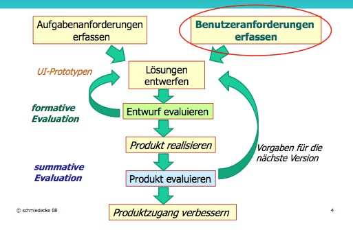

Phasen des Usability Engineering
--------------------------------

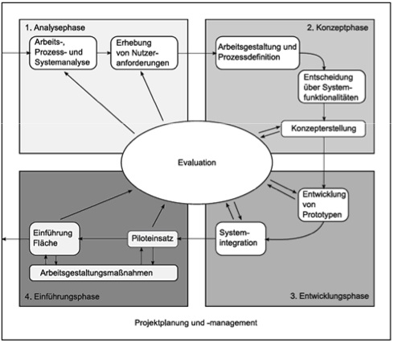

### 1. Analysephase

Analyse der Benutzeranforderungen parallel zur funktionalen Systemanalyse

-	Welche **Benutzer**?
-	Welche **Aufgaben**, welches **Fachwissen**?
-	Welche **Häufigkeit**?
-	Welche **Zielvorgaben**?
-	Welche **Daten, Dokumente** und **Arbeitsmittel**?
-	Welche **Aufgabenverknüpfungen**?
-	Welche **Benutzerkommunikation**?
-	Welche **Fehlersituationen**?
-	Welches **Arbeitsumfeld**?
-	Welche **Hardware** oder **Zusatzsoftware**?

**Ergebnisse** der Analysephase sind

-	Protokolle
-	Personas
-	Prozessbeschreibungen

bzw. wie viele

-	Benutzerklassen
-	Einsatzgebiete
-	Sprachen...

es gibt.

### 2. Konzeptphase / Konzeptionsphase

Interaktionsneutrale Konzeption der Systemfunktionalitäten (Use Cases)

#### Use Cases / Anwendungsfälle

-	klassische Anforderungsmodellierung
-	umfassend, durchdacht und konstruiert, abgeschlossen
-	aus der Aufgabenstellung abgeleitet

#### Interaktionskonzeption und -Evaluation

-	Kartenmodell (Card Sorting)
-	Papierprototypen (Fokusgruppen)
-	genereller Prototyp (Click-Mockup) für Usability-Test

#### Fragestellungen

-	Interaktionsmöglichkeiten für **häufige** Aufgaben
-	Interaktionsmöglichkeiten für **seltenere** Aufgaben
-	**Abhängigkeiten** zwischen den Aufgaben
-	**Zeitliche Verfügbarkeit** der erforderlichen Informationen
-	**Metaphern** und ähnliche Systeme
-	Einbindungsmodus für (spätere) **Add-ons** und Module
-	**Prozess- und Arbeitsplatzänderungen**

### 3. Entwicklungsphase

-	Implementierungen des Papierprototypen oder Click-Mockups
-	**Evaluationstechnik** = Expertenevaluation

### 4. Einführungsphase

-	Pilotbetrieb

	-	Usabilty-Tests mit Benutzern
	-	Fragebögen
	-	Interviews

-	Nutzung der Ergebnisse

	-	Verbesserung der Schulungsmaterialien
	-	Verbesserung der Hilfetexte
	-	Bereitstellung von Service-Packs bzw. Updates mit kleinen Funktionserweiterungen
	-	Verbesserung der Marketingmaterialien
	-	Anregungen für die nächste Version des Systems
	-	Anregungen für weitere Add-Ons und Module

Evaluation
==========

Voraussetzungen
---------------

-	Definiertes Ziel
-	Definierte Annahmen
-	Definierte Methodik
-	Klares Kosten-Nutzen-Verständnis

Einordnung in den Entwicklungsprozess
-------------------------------------

### formative Evaluation

> Hier findet am meisten HCI statt

-	Evaluation eines **geplanten** Produkts
-	Entwurfs- und Entwicklungsbegleitend

### summative Evaluation

> Bilanz über alle Features

-	Evaluation eines **fertigen** Produkts
-	Einhaltung der geforderten Usability-Qualität

Evaluationstechniken
--------------------

### Überblick

-	Theoriebasierte Evaluation

	-	Informationsanalyse
		-	Dokumentenanalyse
			-	Styleguides, Schulungs- und Marketingmaterialien
			-	Supporttickets und -protokolle
		-	Datenanalyse
			-	Logdateien
			-	Clickstreams
			-	Eyetracking-Protokolle
	-	Expertengutachten *(deutlich günstiger als Benutzerevaluation)*
		-	Heuristische Evaluation
		-	Cognitive Walkthrough

-	Benutzerbasierte Evaluation

	-	Befragung
		-	Umfrage
		-	Interview
	-	Usability-Test (im Labor)
		-	Videoaufzeichnung
		-	Logging
		-	Eyetracking
		-	Think-Aloud
	-	Beobachtung (vor Ort)
		-	(Feld-)Studie
		-	Ethnographie

### Heuristische Evaluation (nach Nielsen)

-	**Mehrere Usabilty-Experten** bewerten ein System aufgrund einfacher und allgemeiner Heuristiken. **Einfach und kostengünstig!** Es ist jedoch **einiges Anwendungswissen nötig.**

-	Einsatz auf Mockups, Prototypen oder Fertigsystemen

-	Bewertung anhand vorgegebener Ziele

	-	Erlernbarkeit
	-	Fehlerbehandlung
	-	Funktionalität
	-	Frustration...

-	*Mit 5 Evaluatoren / Evaluationen werden 75% der Mängel gefunden*

#### Ablauf

1.	Input sammeln
2.	Evaluation des Systems
3.	Sammeln und Auswertung
4.	Bewerten der Ergebnisse

#### Benutzbarkeitsheuristiken nach Nielsen:

(Erklärungen aus [http://glossar.hs-augsburg.de/Heuristische_Evaluation)](http://glossar.hs-augsburg.de/Heuristische_Evaluation)\) (Andere Heuristiken möglich, z.B. Gestaltungskriterien nach ISO 9142-110...)

##### 1. Sichtbarkeit des Systemstatus

Das System sollte dem User mit angebrachten Infos fortwährend mitteilen was geschieht.

##### 2. Übereinstimmung zwischen System und der realen Welt

Das System sollte in Wort und Phrase die Sprache der Anwender sprechen und nicht zu systemorientiert sein

##### 3. Benutzerkontrolle und Freiheit

Da User öfter mal Fehler machen, sollte das System hierfür "Emergency Exits" haben, sowie Undo- und Redo-Funktionen

##### 4. Konsistenz und Einhaltung von Standards

Das System sollte Konsistent sein und bestimmten Standards folgen, damit sich der User immer zurechtfindet

##### 5. Fehlervermeidung

Besser als jede gute Fehlermeldung ist die Vermeidung von Fehlern

##### 6. Wiedererkennen anstelle von Erinnern

Die Bedienung sollte soweit es geht selbsterklärend sein ohne das sich der User groß erinnern muss. Auch sollte er sich nicht Informationen von einem Dialog für einen anderen merken müssen.

##### 7. Flexibilität und Effizienz

Für erfahrene User sollte es Abkürzungen geben die das Arbeiten mit dem System beschleunigen. Die „Shortcuts“ sollten allerdings Anfänger nicht verwirren. User sollten sich auch von ihnen häufig verwendete Funktionen speziell zurechtlegen können.

##### 8. Ästhetisches und minimalistisches Design

Dialoge sollten notwendige Informationen enthalten. Jede zusätzliche Information lenkt nur von den Fakten ab und hält den Benutzer auf.

##### 9. Hilfe für den Benutzer um Fehler wahrzunehmen, zu erkennen und zu beheben

Fehlermeldungen sollten in verständlicher Sprache sein, das Problem genau beschreiben und Lösung vorschlagen

##### 10. Hilfe und Dokumentation

Selbst wenn der User für die Nutzung des System keinerlei Unterstützung bedarf, sollte es doch, gerade bei komplexen Interfaces, gute Dokumentation geben die in die Struktur integriert sind. Eine Hilfe an entsprechender Stelle sollte sowohl kontextabhängig als auch verständlich verfasst sein und konstruktive Lösungsansätze bieten.

### Cognitive Walkthrough

-	Benutzbarkeits-"Gedankenexperiment"
-	naives Benutzerverhalten verschiedener **fiktiver Benutzer (Personae)**
-	Experten durchlaufen stellvertretend alle Aktionen
-	Versuch, Probleme stellvertretend zu identifizieren
-	Durchführung ausgewählter Szenarien anhand eines konkreten Testplans
-	systematisches Protokoll

#### Vorbereitung

-	Detaillierte Beschreibung der **Personae** und **Szenarien**
-	Liste der möglichen Aktionen / Lösungswege
-	Mockup / Prototyp / Installation des Systems

#### Arbeitsannahmen

-	Benutzer sucht die erforderlichen Funktionen
-	Benutzer ist frei in der Wahl der Funktionen

#### Fragen

-	Auffindbarkeit der Funktionen
-	Handhabbarkeit des Systems
-	Verständnis des Feedbacks

### Benutzerstudie

Vorbedingungen:

-	Nutzerauswahl
-	Ziel der Studie
-	Festgelegte Methodik
-	Definierter Evaluationsprozess
-	Metriken und Auswertungsverfahren: Quantifizierbarkeit?
-	Qualität: Pilottest <--> Untersuchung

#### Beobachtung

-	im Labor oder in der realen Umgebung
	-	**reale Umgebung**: Feldstudie, Ethnographie
	-	**Labor**: Usability-Experiment
-	Beobachtung liefert primär qualitative Ergebnisse
	-	mathematische oder systematische Auswertung kaum möglich

Die Datensammlung erfolgt durch:

-	Notizen
-	Fotos
-	Tonaufnahmen
-	Videos
-	Materialsammlung
-	viel Datenmaterial

grundsätzlich ist alles sammelnswert.

##### reale Umgebung: Feldstudie

-	**strukturierte Beobachtung**
-	Ziele und Beobachtungsgegenstände vorher festlegen
-	strukturieren, Kategorien bilden, z.B.
	-	Jugendliche, Erwachsene, Senioren
	-	Orientierung, Anfrage, Geschäftsabschluss
	-	Frühschicht, Mittelschicht, Spätschicht
-	Erhebungsbögen vorbereiten
-	Platz für freie Beobachtungen lassen
-	**Voraussetzung:** gute Vorkenntnisse über das Einsatzgebiet

Vorteile der Feldstudie:

-	gezielt und effektiv
-	gut durchzuführen
-	wiederholbar
-	Ergebnis garantiert

##### reale Umgebung: Ethnographie

-	**unvoreingenommene Beobachtung**
-	keine im voraus festgelegte Struktur
-	Beobachter betrachtet alles als "fremd"

Vorteile der Ethnographie:

-	vorurteilsfrei
-	unerwartetes wird entdeckt
-	natürliche Strukturen werden erkennbar

##### Beobachtungstechniken

-	Beobachtungsprotokoll
-	Videoaufzeichnung
-	Software-Log
-	Think-aloud-Protokoll
-	Ethnographie
	-	"Eindrücke aus der Beobachtung?"

#### Befragung

##### Generelles

-	Fragen sehr sorgfältig vorbereiten, weniger ist mehr
-	Testen mit Testbenutzern (Verständlichkeit, Umfang, Motivation)
	-	Testauswertung führt zur Präzisierung der Fragen
-	Zielgruppe wählen
-	**Zielfrage: Was will ich herausbekommen?**

##### Umfrage / Fragebogen

-	Große Probandenanzahl
-	Mischung aus geschlossenen und offenen Fragen
-	muss selbsterklärend sein
-	anonym
-	schafft große Datenbasis
-	Gut auszuwerten
-	Nachhaken nicht möglich

##### Interview

-	Besonders aufwändig
-	kleine Probandenzahl
-	**sehr gute Ergänzung zur Umfrage**
	-	oft zur Verifikation oder Präzisierung **nach einer Umfrage** oder Beobachtung
-	Mischung aus vorstrukturierten und spontanen Fragen
-	muss gut strukturiert und kurz sein
-	präzise Planung
-	begrenzter Themenbereich
-	Auswertung aufwändig

---

Benutzerfähigkeiten
===================

Arten
-----

-	Primär
	-	Sehen
	-	Motorik
	-	Gedächtnis
-	Sekundär
	-	Hören
	-	Sprechen
-	Spezialisiert
	-	Musikalische Fähigkeiten (Midi-Einspielungen)
	-	Graphische Fähigkeiten (Feinmotorik am Tablett)
	-	Handwerkliche Fähigkeiten

Gedächtnis und Kognition
------------------------

-	Gedächtnisforschung ist Teil der Psychologie
	-	daher "psychische Benutzereigenschaft"
-	**Gedächtnis ist zentral für die Interaktion**
	-	keine **Interaktion** ohne **Kognition**
	-	keine **Kognition** ohne **Gedächtnis**

**Kognition** steht für die menschliche Informationsverarbeitung (Erkennen, Durchdenken, Anwenden...)

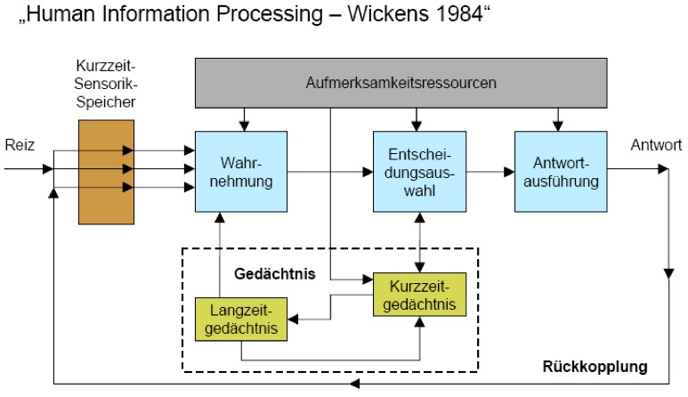

### Das Gehirn

-	vegetative Prozesse
-	Sinneswahrnehmungen
-	unbewusste Denkprozesse
-	bewusste Denkprozesse

### Gedächtnisarten

#### Sensorisches Gedächtnis

-	"Kurzzeit-Sensorik-Speicher"
-	ikonischer Speicher (12 Chunks, 0,5 sec Persistenz)
	-	visuelle Informationen
-	echoischer Speicher (bis 5 sec. Persistenz)
	-	auditive Informationen

##### Filter

**Filter für Übergang in KZG:** Lenkung der Aufmerksamkeit

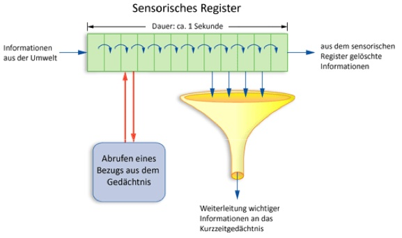

**Wahrnehmungsfilter: Prägnanz**

-	Es ist kein Dauerreiz (Sensorischer Filter)
-	Reiz passt in den aktiven Kontext (KZG)
-	Es gibt Vorwissen zum Reiz (LZG)

#### Kurzzeicht-Gedächtnis (KZG)

-	Arbeitsgedächtnis / "Arbeitsspeicher"
	-	Planung und Orientierung im Handlungsprozess
-	**klein:** 7 +/- 2 Chunks
-	**flüchtig:** 15-30 sec.
-	störungsanfällig
-	Informationsverlust durch Überlastung
-	auffrischbar durch Wiederholung

**Filter für Übergang in LZG:** Lernen

##### Das KZG und Interaktion

-	Warum ist bei der Gestaltung von Dialogen eine **Überlastung** des KZG zu **vermeiden**?
	-	*störungsanfällig*
-	Warum ist es wichtig, längere Menüs oder Listen zu **gruppieren**?
	-	*Chunking zur Unterstützung des KZG*
-	Warum sind **optische Gruppierungen** besser als nur Überschriften im Textfluss?
	-	*Chunking, unterstützt durch die Wahrnehmung (Gestaltgesetze)*

#### Langzeicht-Gedächtnis (LZG)

-	Unbegrenzte Kapazität und Persistenz (100 TB)
-	Assoziatives Wissensnetz
-	Zugriffszeit 8 sec. / Chunk
-	Zugang zum Wissensnetz via **Recall / Recognition**

##### Assoziationen

Der Zugriff auf Informationen findet über Assoziationen statt. Assoziationen sind sozusagen der Schlüssel zu Informationen.

-	je mehr
-	je neuer
-	je frequentierter

diese Schlüssel sind, desto besser lassen sich die verknüpften Informationen abrufen. Schlüssel kann man verlegen, aber gute Schlüsselanhänger sind z.B. Eselsbrücken, Klänge, Bilder, Emotionen. (sind eigentlich wiederum eigene Schlüssel). Assoziationen verblassen, sind aber reaktivierbar.

###### Recall

Aktive Suche nach Assoziationen.

###### Recognition

(Re-)Aktivierung von Assoziationen.

##### ACT-Modell

"Adaptive Control and Thought" - Geht davon aus dass das LZG in einen **Deklarativen** und **Prozeduralen** Teil unterteilt ist.

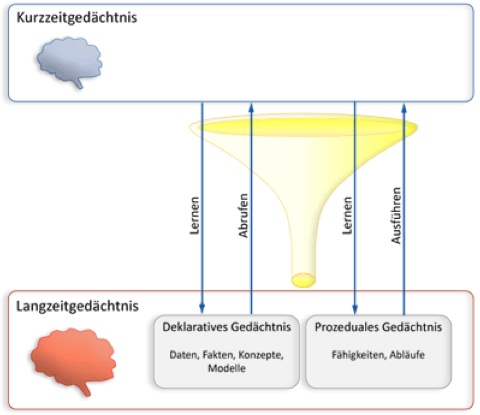

*Prozedurale Inhalte sind leichter abrufbar als deklarative.* -> Learning by Doing

###### Deklaratives Gedächtnis

-	Fakten
-	Konzepte, Modelle
-	Erlebnisse

###### Prozedurales Gedächtnis

leichterer Zugang

-	Abläufe
-	Klänge, Farben
-	Emotionen

### Konzentration

Konzentration bedeutet **Bündelung der Aufmerksamkeitsressourcen**

-	zielgerichtet koginitiv arbeiten
-	optimale KZG-Leistung
-	keine (wirksame) Störung

**Bündelung der Aufmerksamkeitsressourcen ist Arbeit!** Erleichterung durch:

-	KZG-Entlastung
-	Störungsvermeidung

### Lernen

Ist die gezielte **Assoziationsbildung** und "-pflege". (Wiederholung, Eselsbrücken, alternative Darstellungen)

-	Nutzung der **rechten Hirnhälfte**
	-	prozedurales Gedächtnis, Affekte...
-	Unterstützung der **linken Hirnhälfte**
	-	gute, logische Strukturen -> klares mentales Modell

Visuelle Wahrnehmung
--------------------

Das **Sehvermögen** ist rein physisch, während die **visuelle Wahrnehmung** als ganzes ein zum Teil kognitiver Prozess ist.

Die **visuelle Wahrnehmung ist:**

-	**Unbewusste** Vorverarbeitung
-	Erkennen bekannter **Strukturen**
-	**Vorsortierung** der visuellen Information
-	Unterdrückung von **Dauerreizen** (Hintergrundstrukturen)

### Das Auge

-	Sehfeld zentral unterhalb der Mitte
-	Schärfelücke am seitlichen Rand
-	Farbwahrnehmung ist adaptionsabhängig
	-	Farben sind nur bei Helligkeit wahrnehmbar
	-	"nachts sind alle Katzen grau"
	-	Adaption und Farbwahrnehmung "altern" deutlich

#### Probleme mit Farbe

Weniger als 5% der Sehzellen sind Zäpfchen (Farbsehen)

Farben werden unterschiedlich fokussiert. Das führt zu einem Schärfeproblem. **Blau wird am stärksten gebrochen, Rot am wenigsten. Daher niemals Blau-Rot Kontrast einsetzen!**

Ausserdem sollte eine Darstellung auch immer in s/w erkennbar sein (hoher s/w Kontrast). 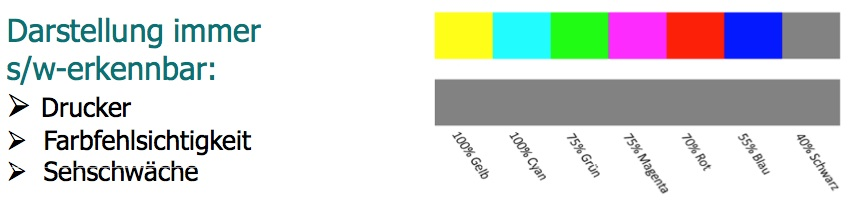

Kräftige Farben und hohe Kontraste können zu einem **komplementärfarbigen Nachhall** führen. Dieser ist unangenehm und zu vermeiden.

Ebenfalls benötigen **feine Strukturen einen hohen S/W Kontast**.

#### Sehfeld

Das **zentrale Sehfeld** sollte **optimal ausgenutzt** werden. Der **untere Rand** eignet sich gut für **Statusmeldungen/Infos.**

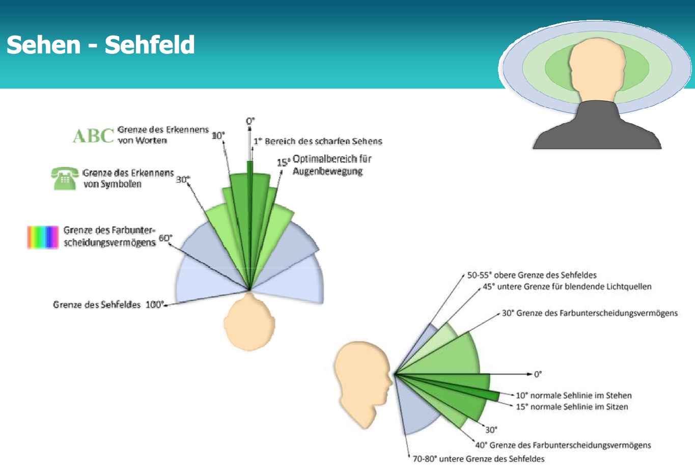

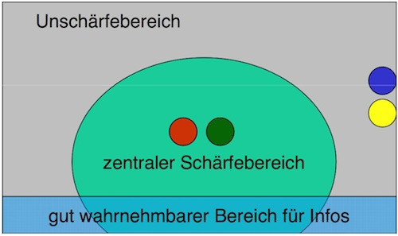

#### Eingeschränktes Sehvermögen

-	aufgrund von Alterung / Erkrankung / Sehschwäche
-	aufgrund von Umgebungsbedingungen
-	Kontrast gleicht Schärfemangel aus
-	Möglichst keine Farbschrift, niemals auf farbigem Hintergrund
-	**Rot-Grün Kontrast vermeiden, niemals zentral sinntragend einsetzen!**
-	Adaption entlasten
-	zentrales Sehfeld optimal nutzen

Hören
-----

-	Ohren sind
	-	nicht ausrichtbar
	-	nicht schließbar
-	akustische Reize sind immer da und mischen sich
-	Geräusche summieren sich zu Lärm
-	Für "Normalnutzer" vorbehalten für wenige wichtige Signaltöne
-	Für blinde Nutzer das Hauptmedium
	-	Mischung zwischen vorgelesenen Inhalten und akustischen Inhalten oft schwierig
-	In bestimmten Nutzungskontexten vorrangig (Navi)
-	**akustische Elemente sparsam einsetzen!**

Motorik (Hände)
---------------

Eingabe über Handmotorik (Tastaturen und Zeigegeräte).

Die Alternative dazu wäre Sprach- Ein/Ausgabe für:

-	Menschen mit Behinderungen
-	Bedienug während manueller Arbeit
-	in Situationen, in denen eine manuelle Bedienung nicht geeignet ist
	-	Lebensmittelverarbeitung, Diagnostik

### Effizienz von Eingaben

#### Fitt´s Law

Aufwand der **Mauspositionierung** hängt von **Mausweg** und **Größe des Ziels** ab

> "...Es besagt, dass die benötigte Zeit, um eine Zielfläche zu erreichen, eine Funktion der Distanz zu dieser Fläche und deren Größe ist. Erreichen bedeutet hier, einen motorischen Akt, z.B. das Berühren eines Punktes mit der Hand, dem Finger oder einem Stift – zu Zeiten Fitts'..." - [wikipedia](http://de.wikipedia.org/wiki/Fitts’_Gesetz)

#### Hick´s Law

Der **Aufwand einer Auswahl** hängt von der Zahl der **Entscheidungsschritte** und der Zahl der **Alternativen** ab.

#### GOMS-Aufwandseinschätzung

Goals, Operators, Methods and Selection Rules

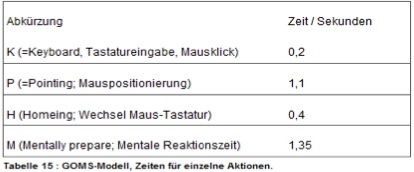

### Tastaturinteraktion - Mausalternativen

-	**Funktionstasten**
	-	**\+** Beschleuniger
	-	**\-** Lernaufwand, reduzierbar durch Belegungsaufkleber, Mousepads...
-	**Tastenkombinationen**
	-	**\+** Mnemonik möglich --> LZG-entlastend
		-	Mnemonik bedeutet in diesem Fall z.B. ein Buchstabe zur schnellen Auswahl eines Eintrags aus einem Menü
	-	**\-** einige Kombinationen sind motorisch schwierig
-	**Navigation: Cursorblock, Pfeiltasten, Tabulator**
	-	**\+** effizient, sollten immer als Alternativen angeboten werden
	-	**\+** auch aus Gründen der Barrierefreiheit

---

Interfacegestaltung
===================

Generelles
----------

### Benutzerorientierte Gestaltung

-	**Zielgruppenorientierung**
	-	Benutzerprofile und Personas
	-	Kommunikationsparadigmen
	-	zielgruppengerechtes konzeptuelles Modell (Vorwissen, Fachlichkeit)
-	**Orientierung am Benutzungskontext**
	-	Einsatzsituation(z.B. Staub, Lärm, Ablenkung, Zeitdruck, Kritikalität)
	-	Art der Geräte (z.B. Bildschirmgröße, Touch oder Maus)
	-	Auswahl geeigneter Interaktionshardware und -formen
-	**Einbeziehung der Benutzer (oder Orientierung an Personas)**
	-	Menü- und Funktionsstruktur (Card Sorting)
	-	Entscheidung über primäre und sekundäre Funktionen
	-	Verständliche / fachgerechte Struktur und Naviation
	-	Vorerfahrung mit anderer Software, Vorlieben
-	**Barrierefreiheit**

### Allgemeine Gestaltungsregeln

-	**Gleichförmigkeit** der Gestaltung
-	Sichtbarkeit des **Systemzustands**
-	**Affordanz** (und nicht-Modalität)
	-	> "...ist die von einem Gegenstand – offensichtlich vorhandene oder tatsächlich gegebene – angebotene Gebrauchseigenschaft für Subjekte (Mensch oder Tier)..." [wikipedia](http://de.wikipedia.org/wiki/Angebotscharakter)
-	deutliche **Strukturierung**
-	**Chunking** durch Schichtenbildung
-	gut entschlüsselbare **Informationscodierung**
-	offener Text (falls Text nötig)
-	hinreichend große, gut unterscheidbare Bedienelemente
-	keine Mauskilometer
-	WIMP-Kriterien
	-	**W** indows
	-	**I** cons
	-	**M** enus
	-	**P** ointing device
-	**harmonischer Farbeinsatz**

#### Gestaltung mobiler Anwendungen

-	**responsive** Design
-	verständliche Struktur und Navigation
-	möglichst viele **natürliche Gesten** (ohne visuelle Kontrolle)
-	Eingabe durch Auswahl
-	**Vermeidung** von **Texteingabe**
-	Gestaltung an die Plattform angepasst
-	Möglichst alle Bedienmodi gut unterstützen
	-	Portrait, Landscape
	-	Single-Handed, Double-Handed, Cradled

### Text

-	Text muss immer **hinreichenden Schwarz-Weiß Anteil** haben *Ich schätze sie mein Kontrast*
-	**Positivdarstellung** im hellen Raum
-	**Negativdarstellung** im dunklen Raum
-	Monitor als **Lichtquelle** nicht unterschätzen!

Gestaltgesetze
--------------

### Gesetz der Nähe und Ähnlichkeit

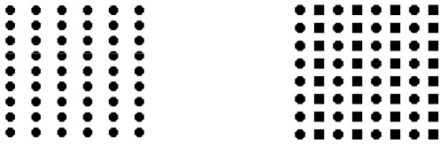

#### Nähe

*Dinge, die räumlich nahe beieinander liegen, werden von unserer Wahrnehmung gruppiert, also als zusammengehörig aufgefaßt. Dinge, die weit voneinander entfernt liegen, werden als getrennt und unabhängig wahrgenommen.* - [kommdesign.de](http://www.kommdesign.de/texte/gestaltpsychologie1.htm)

**Bsp:**

-	Eingabefelder und Beschriftung nahe zusammen
-	Gruppierung (Chunking) von zusammengehörigen Informationen durch Nähe
-	Trennung von unterschiedlichen Informationen durch Abstand

#### Ähnlichkeit

*Dinge, die ähnlich sind, werden von unserer Wahrnehmung gruppiert, also als zusammengehörig aufgefaßt. Umgekehrt werden Dinge, die sich in wichtigen Merkmalen unterscheiden, als voneinander getrennt oder unabhängig wahrgenommen.* - [kommdesign.de](http://www.kommdesign.de/texte/gestaltpsychologie1.htm)

**Bsp:** Ähnliche Buttons für Menüs.

**Negativbeispiel:** Wenig Unterschied zwischen Link und Text, kein Unterschied erkennbar und wird als eins wargenommen.

### Gesetz der Geschlossenheit und Fortsetzung

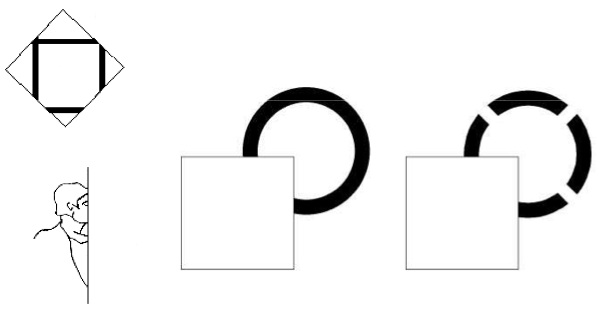

#### Geschlossenheit

*Dinge mit geschlossenem Umriss oder Elemente, die von einer Linie umfaßt sind, werden von unserer Wahrnehmung gruppiert, also als zusammengehörig aufgefaßt. Dinge, die durch Linien getrennt sind, wirken nicht zusammengehörig.* - [kommdesign.de](http://www.kommdesign.de/texte/gestaltpsychologie1.htm)

#### Fortsetzung

*Dinge, die auf einer durchgehenden Linie oder Kurve angeordnet sind, werden von unserer Wahrnehmung gruppiert, also als zusammengehörig aufgefaßt.* - [kommdesign.de](http://www.kommdesign.de/texte/gestaltpsychologie1.htm)

### Gesetz der Guten Form / Gestalt (Prägnanz)

*ede Figur wird als möglichst einfache Struktur interpretiert. Die Wahrnehmung hat also eine Eigentendenz zu »Guten Gestalten«* - [robaweb.de](http://www.robaweb.de/gdm/inhalt/VisuelleWahrnehmung/Gestaltwahrnehmung/03-Gestaltgesetze.html#GesetzDerGutenGestalt)

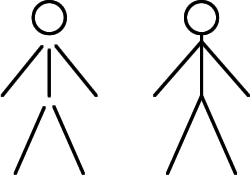

> "...Die klassische Gestaltpsychologie formulierte mehrere Gestaltgesetze der Wahrnehmung. Eines davon ist das Gesetz der Prägnanz. Es besagt, dass in einer Vielzahl von Elementen jene zuerst wahrgenommen werden, die sich in einer oder mehreren Eigenschaften von den anderen abheben. In diesem Zusammenhang ist der Begriff Prägnanz mehr im Sinne von „Hervorgehobensein“ oder „Auffälligkeit“ zu verstehen..." - [wikipedia](http://de.wikipedia.org/wiki/Prägnanz)

---

Mentale Modelle
===============

Mentale Modelle sind **strukturierte Vorstellungen** von einem Gebilde und dessen Verhalten. Sie bilden die **Grundlage der Kognition und Interaktion** Verstehen, Entscheiden, Planen und Handeln geschiehtgrund von Vorstellungen, also mentalen Modellen.

**Beispiel für Modellinkompatibilität:**

*Du markierst eine Seite in MS-Word und stellt via Datei>Seite auf Querformat. Jetzt ist nicht nur die markierte Seite im Querformat, sondern das ganze Dokument*

**Grund:**

Das Dokument ist logisch nicht in Seiten eingeteilt, sondern in Abschnitte. Der Befehl bezieht sich auf den aktuellen Abschnitt.

### Wer besitzt Modelle?

-	**Der (System-)Designer D**
	-	*der Analytiker*
	-	entwirft das **konzeptuelle Modell**
	-	bildet es auf ein **funktionales Modell** der Software ab
-	**Der Benutzer B**
	-	*der Experte*
	-	besitzt ein **mentales Modell** der Realität (Fachwissen)
	-	erwirbt ein **mentales Modell** des Systems
-	**Das System S**
	-	*das implementierte Modell*
	-	stellt ein **implementiertes Modell** von Realität und technischer Funktion dar
	-	realisiert damit das Systemverhalten

### Wovon?

Immer vom **Arbeitsbereich A** (UoD, universe of discourse), Also **B(A), D(A), S(A)**

Die entsprechenden Modelle müssen nicht zwangsläufig harmonieren. Nicht harmonierende Modelle führen zu Missverständnissen.

### Verschiedene mentale Modelle

Wir unterscheiden **konstruierte oder konzeptuelle** und **erworbene** Modelle.

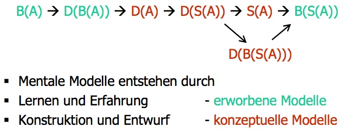

#### konstruierte / konzeptuelle Modelle

-	entstehen durch Konstruktion oder Entwurf
-	Gestaltung einer neuen Realität
-	Vorwegnahme oder Planung

Als Arbeitsgrundlage bildet das konzeptuelle Modell:

-	die **Grundlage des Interaktionsentwurfes**
-	die **Grundlage für das Benutzerverständnis**

Ein **gutes konzeptuelles Modell:**

-	hat **wenige** und benutzernahe Konzepte und Metaphern
-	**klare** Beziehungen zwischen den Konzepten mit möglichst wenigen Ausnahmen
-	ist **erweiterbar** in der voraussichtlichen Entwicklungsrichtung

***Die Qualität des konzeptuellen Modells ist entscheidend für die Gebrauchstauglichkeit der Benutzerschnittstelle!***

#### erworbene Modelle

-	entstehen durch Lernen und Erfahrung
-	ermöglichen den Umgang mit der Realität
-	werden durch Lernen erweitert und korrigiert

### Aufgabe der Usabilty im Bezug auf Mentale Modelle

Ziel der Usabilty ist es konzeptuelle Modelle kompatibel zu initialen Modellen der Benutzer zu entwickeln und diese konzeptuellen Modelle dem Benutzer kommunizieren. Dies kann über

-	explizite Kommunikation
	-	Tutorials
	-	Hilfetexte
	-	Erste Schritte
-	implizite Kommunikation
	-	durch das User Interface

stattfinden.

GUI
===

GUI Entwurf
-----------

### Grundregeln des GUI-Entwurfs

-	**Gleichförmigkeit** der Gestaltung
	-	einheitliche "Kultur" der Oberflächen
		-	Gliederung, Raster und Positionierung
		-	Farbschema
		-	Größe und Gestaltung der Bedienelemente und Icons
		-	Bedeutung der Bedienelemente und Icons
-	**Sichtbarkeit** des Systemzustands
-	**Affordanz** der Bedienelemente
-	Nicht-Modalität
-	**minimalistisches** Design
	-	je einfacher ein GUI desto
		-	*einladender*
		-	*zugänglicher*
		-	*verstehbarer*
		-	*unmittelbarer*
		-	*brauchbarer* wirkt es auf den Benutzer
-	**Strukturiertheit**
	-	Strukturrierung durch visuelle Grundparameter
	-	Symmetrie, bekannte Strukturen, Gitter und Raster
	-	Semantische Struktur
-	**einheitliche Semiotik**
	-	Sprache der Sinnbilder wie z.B. Icons, Navigationssymbole
	-	Auswahl der Gestaltungsform (Strichzeichnung, Farbgrafik, Foto)
-	**offener Text**
	-	Beschriftung
		-	Öffnung durch Kürze
	-	Textblock
		-	Öffnung durch Gliederung

#### Umsetzung der Gleichförmigkeit

-	**gleiche Interaktion hat gleiche Bedeutung**
	-	in verschiedenen Programmen und Programmteilen
-	**einheitliche Feedbackgestaltung**, etwa
	-	*Selektion:* Highlighting
	-	*Aktivierung:* Farbwechsel
	-	*Bewegen:* Start und Ziel visualisieren

##### In GUI-Anwendungen

-	einheitliche Icons / **Funktionstasten**
-	einheitliche Maushandhabung (z.B. Einfach- oder Doppelklick)
-	einheitliche Tastenkürzel
-	(äußere Konsistenz)

##### In innovativen Interfaces

-	einheitliche Gesten und Bewegungen
-	einheitlicher Übergang zwischen realem und virtuellem Objekt

#### Umsetzung von Sichtbarkeit und Affordanz

Viele Computerspiele beziehen ihren Reiz daraus, dass der Spieler die richtige Aktion in einer Situation *rät*. **Allerdings wollen Anwender von Anwendungen nicht spielen und nicht raten**

##### Sichtbarkeit

-	der **Systemzustand** und die **verfügbaren Operationen** sind sichtbar (oder systematisch auffindbar)
-	nicht verfügbare Operationen sind unsichtbar
-	der Navigationszustand ist sichtbar
	-	z.B. via Breadcrump

##### Affordanz

-	allein durch die *Formsprache* wird klar, welches Bedienelement wie zu benutzen ist.

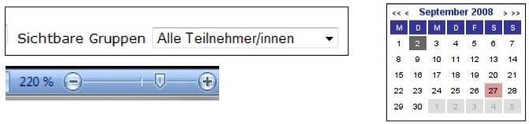

#### Umsetzung der Modi-Vermeidung / Nicht-Modalität

-	**ein Modus ist eine Einstellung**
	-	die die **Bedeutung von Kommandos verändert**
	-	die explizit eingestellt und (zumeist) explizit aufgehoben wird
	-	erfordert die Umstellung eine andauernde Betätigung, so spricht man von *semi-modal* oder *quasi-modal*
		-	Bsp: Umschalttaste vs. Caps-Lock
-	**Modi "sparen" Bedienelemente**
	-	z.B. Umschalttaste auf der Tastatur
-	**Modi sind fehlerträchtig**
	-	Quasi-Modi sind besser
	-	zur Vermeidung von Fehlern **Status auffällig visualisieren**

#### Umsetzung von Strukturiertheit

##### Grundparameter

-	**Größe, Kontrast, Proportion**
	-	stärkster unmittelbarer Eindruck
	-	gezielt sinntragend oder -unterstützend einsetzen
-	**Einsatzziele**
	-	Unterscheidung / Wichtigkeit
	-	Visuelle Schichtung
	-	Fokus - Interesse (u. evtl. Emotionen) wecken
	-	Benutzerblick führen

##### Techniken

-	**Schichten bilden**
	-	Gruppen mit max. 7 Elementen bilden (Chunking)
	-	Gruppen nach Wichtigkeit, Fokus, etc. einstufen
	-	Visuelle Grundparameter nutzen, um die Einstufung zu visualisieren
	-	es entstehen **Wahrnehmungsschichten**
-	**Unterscheidung schärfen**
	-	z.B. durch weitere Gemeinsamkeit in Gruppen oder gruppenübergreifend (Farbspektrum)
	-	ggf. Merkmale hervorheben (z.B. Rechteck - Quadrat)
-	**Vorder- und Hintergrund abstimmen**
	-	Platzierung
	-	Farbgebung
	-	Rahmen, Linien

GUI Prototypen
--------------

### wozu UI-Prototypen?

Usability steht und fällt mit der UI-Gestaltung.

-	iterative Entwicklung
	-	Prototyp-Iterationen sind in **DIN EO ISO 9241-210** (Prozess zur Gestaltung gebrauchstauglicher interaktiver Systeme) festgeschrieben
-	**Beteiligung von Benutzern**
-	verschiedene Stufen der Genauigkeit
-	Kleinigkeiten entscheiden oft über Akzeptanz

### Evaluation von Prototypen

Jeder Prototyp ist evaluierbar. Evaluiert wird entweder durch

-	**Experten (Experten-Evaluation)**
-	**Testbenutzer**
	-	simulieren Anwendungsfälle und kommentieren ihr "Nutzungerlebnis"
	-	bewerten ohne vorgegebene Kriterien ("Bauchgefühl")
	-	beantworten gezielte Fragen (Interview, Fragebogen)

**Je einfacher der Protoyp:**

-	umso **besser fokussiert** er den Blick auf die essentielle Interaktion
-	umso einfacher lässt er sich **unmittelbar bearbeiten**
-	umso geringer ist die Scheu des Testers, **Änderungswünsche** zu äußern

**High-Fidelity-Prototypen ermöglichen präzisere Bewertung.**

### Low-Fidelity vs. High-Fidelity

Prototypen lassen sich nach **Low-Fidelity** und **High-Fidelity** Prototypen einteilen.

> **Low-fidelity prototypes** are often paper-based and do not allow user interactions. They range from a series of hand-drawn mock-ups to printouts. In theory, low-fidelity sketches are quicker to create. Low-fidelity prototypes are helpful in enabling early visualization of alternative design solutions, which helps provoke innovation and improvement. An additional advantage to this approach is that when using rough sketches, users may feel more comfortable suggesting changes.
>
> **High-fidelity prototypes** are computer-based, and usually allow realistic (mouse-keyboard) user interactions. High-fidelity prototypes take you as close as possible to a true representation of the user interface. High-fidelity prototypes are assumed to be much more effective in collecting true human performance data (e.g., time to complete a task), and in demonstrating actual products to clients, management, and others.

[Prototyping | Usability.gov](http://www.usability.gov/how-to-and-tools/methods/prototyping.html)

### Papier-Prototyp - Low-Fidelity

-	alles was schnell geht
-	von sketchy bis akkurat
-	schnell zu ändern
-	wirkt nicht wertvoll
-	schafft keine Distanz

Für die Gruppenkommunikation oft besser:

-	Whiteboard
-	Overhead-Projektor
-	Pinwand
-	Flipchart

### Digitale Prototypen - High- Fidelity

High-Fidelity-Prototypen ermöglichen präzisere Bewertung.

-	Zeitmessung für Interaktionen
-	Eyetracking, um die Orientierung zu untersuchen
-	Handhabungsbewertung nach dem 6-Ebenen-Modell
-	Visuelle Eigenschaften
	-	Erkennbarkeit
	-	Lesbarkeit
	-	Informationsdarstellung
	-	Informationsfülle
	-	Chunking
-	Verständniseigenschaften
	-	Bezeichnungen
	-	Texte
	-	Icons
-	Designbewertung

### Card Sorting

*"In welchem Menü steckt nochmal...?"*

Card Sorting wird begleitend beim Prototyping durchgeführt. Durchführung:

-	Alle Informations- und Funktionseinheiten auf Karten schreiben
-	Kategorien auf Karten schreiben, Karten einsortieren lassen

oder

-	oder Karten sortieren lassen, dabei Kategorien benennen lassen

---

Prozess- und Handlungsmodelle
=============================

Überblick
---------

Modelle über das **wie** der Arbeit. Ziel: Die Arbeit soll **leicht** zu erledigen sein.

**Hintergrund**

-	Lern- und Verhaltenstheorie
-	Arbeitstheorie
-	Kybernetik

### Modellierung des Handlungsablaufs

#### Definitionen

##### Handlung

*Eine Handlung ist die kleinste Einheit des Verhaltens in Bezug auf ein bewusstes Ziel.*

##### Kontrollierter Prozess

*Ein kontrollierter Prozess wird **bewusst** durchgeführt und benötigt daher **Aufmerksamkeit** und verwendet das **Kurzzeitgedächtnis**.*

-	koginitive Arbeit
-	keine Parallelität
-	variabel und anpassbar

##### Automatisierter Prozess

*Ein automatisierter Prozess wird **nicht bewusst** gesteuert und benötigt daher **keine Aufmerksamkeit** und kann daher **parallel** zu weiteren Handlungen ausgeführt werden.*

-	keine koginitive Arbeit
-	parallel "im Hintergrund"
-	kaum anpassbar

##### Fehler

*Fehler sind die nicht-Übereinstimmung zwischen dem Ziel des Benutzers und der Reaktion des Systems.*

#### 3 Ebenen der Schwierigkeit

-	**Verständnis -> mentale Modelle**
-	**Ablaufsteuerung -> Prozessmodelle**
-	**Handhabung -> Handlungsmodelle**

##### Mentale Modelle

Siehe Modell-Inkompatibilitäten bei mentalen Modellen

##### Prozessmodelle

-	kognitiver Aufwand der Prozesssteuerung
-	**Fehlerquellen**

##### Handlungsmodelle

-	**Aufwand**, intellektuell und manuell / sensorisch
-	Zerlegung, von der Idee bis zur Durchführung und Bewertung
-	dargesellt als "Abstand"

### Zusammenfassung Handlungsmodelle

#### Wichtigste Fragestellungen für Prozess- und Handlungsmodelle

-	Woher rühren Benutzungsfehler?
-	Woher rührt ein erhöhter Benutzungsaufwand?

-	**Benutzungsfehler**

	-	kybernetisches Modell des regulierten Handlungsprozesses
	-	kognitive, flexible und automatisierte Regulationsebene
	-	Denkfehler, Gewohnheitsfehler, Treffgenauigkeitsfehler

-	**Benutzungsaufwand**

	-	Transformationsdistanzen (Modell der Klüfte)
	-	Zeitliche Gliederung in Handlungsschritte (Norman-Modell)
	-	Gliederung in Abstraktionsebenen (6-Ebenen-Modell)

Modelltypen
-----------

### Allgemeines Modell des Handlungsprozesses

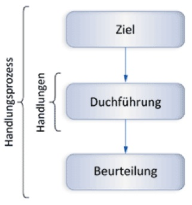

### Modell des regulierten Handlungsprozesses (kybernetisches Modell)

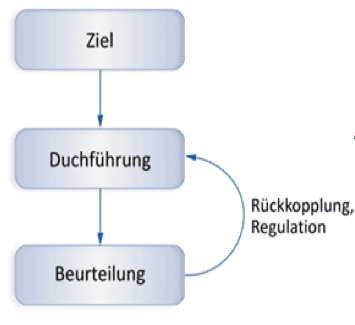

#### Handlungsregulation

-	**bewusste** Regulation (kognitiv)
-	**automatisierte Regulation** (sensomotorisch)
-	**flexible** Regulation (situationsbezogen kombiniert)

Fehler beeinträchtigen die Zufriedenheit des Benutzers. Ziel ist **Fehlervermeidung**. Fehlerebenen:

-	leicht (Ziel bleibt erreichbar)
-	schwer (Ziel verfehlt)

##### Fehler bei bewusster Regulation

-	**Planungsphase (Ziel-Planung)**
	-	Denkfehler
-	**Durchführungsphase**
	-	Merkfehler / Gedächtnisfehler
-	**Beurteilungsphase**
	-	Interpretationsfehler

##### Fehler bei automatisierter Regulation

-	Fehler im Bewegungsablauf ("Danebentippen")
-	Planung-Durchführung-Beurteilung nicht differenzierbar

##### Fehler bei flexibler Regulation

-	**Planungsphase (Ziel-Planung)**
	-	Gewohnheitsfehler / "Betriebsblindheit"
-	**Durchführungsphase**
	-	Unterlassensfehler / Übereile
-	**Beurteilungsphase**
	-	Erkennensfehler

### Modell der Klüfte (oder Transformationsdistanzen)

Grundlage der meisten detaillierten Handlungsmodelle

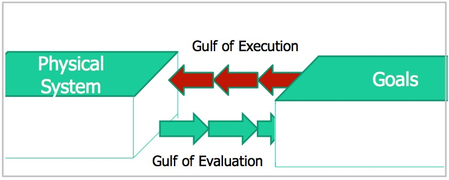

#### Transformationsdistanzen

-	Schwierigkeit beim Übergang zur nächsten Handlungsebene
-	in Pfeilrichtung
-	Bezeichnet als Kluft oder **Transformationsdistanz**
-	**glatter Übergang = keine Distanz**

##### was tun bei der Lokalisierung erhöhter Transformationsdistanzen?

entweder:

1.	Modifikationskonzept
2.	Handhabungs-Test
3.	Umsetzung

oder:

-	Glättung des Übergangs durch Handbuch oder Hilfe

### Modell der 7 Handlungsschritte (Norman)

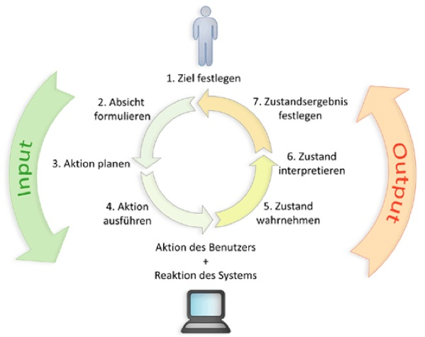

#### Mögliche Schwierigkeiten beim Übergang in die nächste Handlungsebene (Kluft der Ausführung)

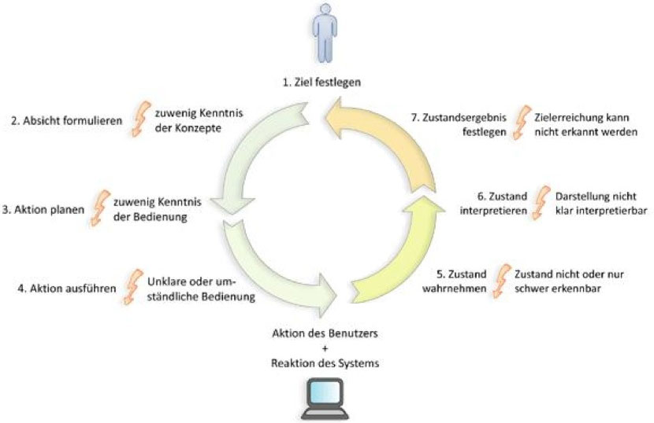

-	**2. Absicht formulieren**
	-	zu wenig Kenntnis der Konzepte
-	**3. Aktion planen**
	-	zuwenig Kenntnis der Bedienung
-	**4. Aktion ausführen**
	-	unklare oder umständliche Bedienung
-	**5. Zustand wahrnehmen**
	-	Zustand nicht oder nur schwer erkennbar
-	**6. Zustand interpretieren**
	-	Darstellung nicht klar interpretierbar
-	**7. Zustandsergebnis festlegen**
	-	Zielerreichung kann nicht erkannt werden

### IFIP-Modell

**IFIP** = International Federation for Information Processing

Gliederung der Schnittstelle in **Abstraktionsebenen:**

-	Organisationsschittstelle
-	Werkzeugschnittstelle
-	Dialogschnittstelle
-	Ein-/Ausgabeschnittstelle

Grundlage für die Standardisierung (Normung) von Gestaltungsgrundsätzen für Benutzungsschnittstellen.

### Das 6-Ebenen-Handlungs-Modell (nach M.Herczeg)

1.	**Intentionale Ebene**
	-	Ebene des Anwendungsgebiets und des Zwecks
2.	**Pragmatische Ebene**
	-	Ebene der Arbeitsziele und Verfahren
3.	**Semantische Ebene**
	-	Ebene der Arbeitsobjekte und Operationen
4.	**Syntaktische Ebene**
	-	Ebene der Ein- und Ausgaberegeln
5.	**Lexikalische Ebene**
	-	Ebene der Zeichen und der Alphabete
6.	**Sensomotorische Ebene**
	-	Ebene der Motorik und Sensorik

Eine **minimale Wahrnehmung der Ebenen** bedeutet dass das System **optimal** an den Benutzer angepasst ist.

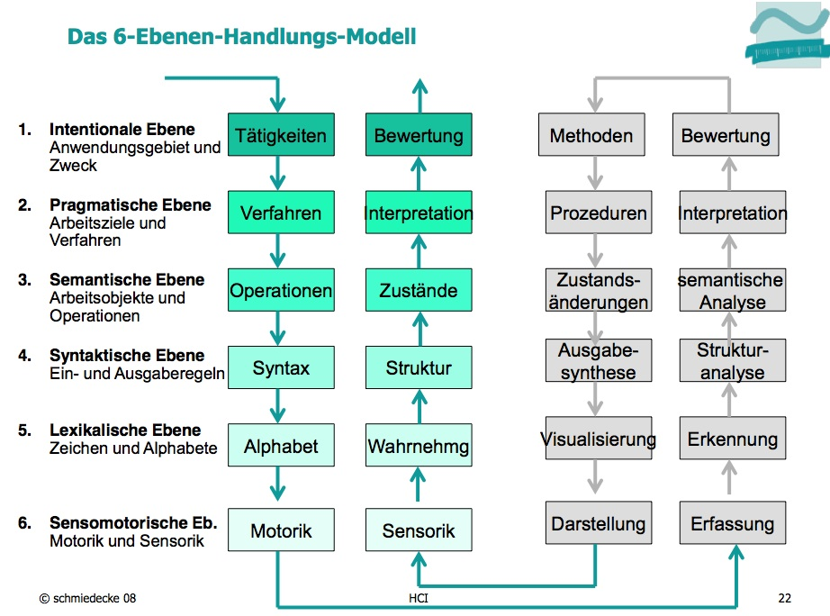

#### Transformationsdistanzen aufgrund von Behinderungen

-	**motorische Behinderungen**
	-	vorwiegend lexalische und sensomotorische Ebene betroffen
	-	Erleichterungen auf der syntaktischen Ebene sind sinnvoll
-	**Seheinschränkungen**
	-	vorwiegend sensomotorische Ebene betroffen
	-	Änderungen auf höheren Ebenen können die zu lesende Informationsmenge reduzieren
-	**eingeschränkte Gedächtnisleistung**
	-	vorwiegend syntaktische und semantische Ebene betroffen
	-	Reduktion der Belastung durch Visualisierung, oder Reduktion auf pragmatischer Ebene

---

Paradigmen
==========

Kommunikationsparadigmen
------------------------

### Als was erscheint mir der Computer?

-	Computer als **Arbeitsmittel (Ressource)**
	-	der Mensch setzt den Computer ein
-	Computer als **Werkzeug (Funktion oder Automat)**
	-	der Mensch bedient den Computer
-	Computer als **Kommunikationspartner (Assistent, Partner, Überwacher oder Ausführender)**
	-	der Mensch kommuniziert mit dem Computer
-	Computer als **Medium (Mittel zur Anwendungswelt)**
	-	der Mensch interagiert mit über den Computer
-	Computer als **künstliche Realität (der Computer wird unsichtbar)**
	-	der Mensch bewegt sich in einer künstlichen Welt

Interaktionsparadigmen
----------------------

### Kommandosysteme

*Bsp: Terminal*

-	Sehr effizient und ausdrucksmächtig
-	optimal zielführend
-	anpassbar / erweiterbar
-	praktisch unbegrenzter Funktionsumfang
-	besonders geeignet für:
	-	variable, komplex zusammenhängende Funktionen
	-	Anwendungsexperten
	-	Erstellung "maßgeschneiderter" Funktionsmengen durch Admins
	-	Test und Testgenerierung
	-	Logging
-	**Vorteile:**
	-	benutzergeführt
	-	unterstützt Parametrisierung und Makrobefehle
	-	gut protokollierbar

### Menü-Maskensysteme

*Bsp: SAP-Eingabemaske, Steuerprogramm*

-	**Vorteile:**
	-	benutzergeführt
	-	Entlastung des LZG durch Vorgaben
	-	freie Navigation
	-	wenig fehlerträchtig

### Direkte Manipulation

*Bsp: Photoshop*

-	**Methaphorische Dialoge**

	-	Arbeitsobjekt und Werkzeuge als **Metaphern** dargestellt
		-	Büro
		-	Grafikstudio / Retusche
		-	Tonstudio
		-	Setzerei / Layout
		-	Leittechnik
	-	Generische Werkzeuge - Anwendungsübergreifend
	-	wysiwyg - unmittelbares Feedback
	-	unmittelbares Undo

-	**Vorteile:**

	-	leicht erlernbar
	-	geringe Transferanforderungen
	-	Ergebnis unmittelbar sichtbar
	-	Aktion intuitiv umkehrbar

-	**Nachteile:**

	-	keine Komplexoperationen möglich
	-	Metaphernbildung wirkt manchmal gezwungen

### Hypermedia / Navigation

-	**mehrere Informationsebenene**
	-	Netz
	-	mehrere Wege zur Info
-	**Probleme**
	-	Orientierung
	-	Suche
	-	Navigation-Zielfindung

#### Kriterien für gute Navigation

Ein Benutzer kann gut navigieren, wenn er jederzeit folgende Fragen beantworten kann:

-	Wohin kann ich gehen? Welche Wege gibt es hier?
-	Wie komme ich dorthin?
-	Wo bin ich schon überall gewesen?
-	Wie komme ich wieder zurück? Wie kann ich meinen Weg zurückverfolgen?
-	Wie komme ich hier schnell wieder heraus?

### Belastung des LZG

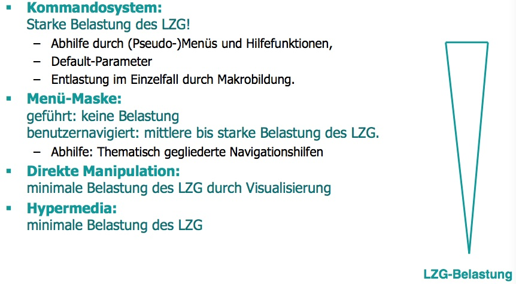

### Belastung des KZG

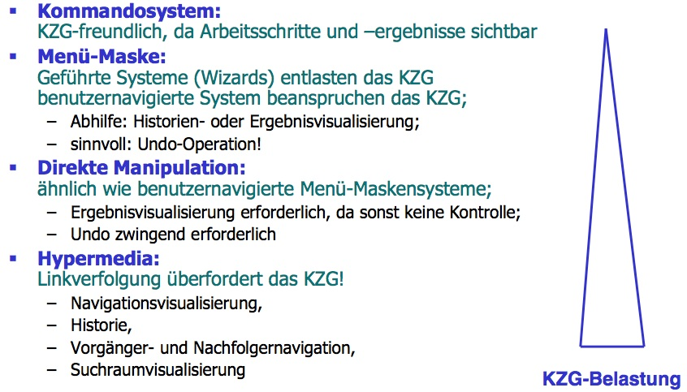

WIMP Paradigma
--------------

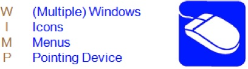

### WIMP Interaktionselemente

-	**Fenster**
	-	Haupt, Unter- und Dialogfenster
-	**Menüs**
	-	Drop-down und Pop-up-Menüs
-	**Widgets**
	-	Knöpfe ("Schaltflächen" lt. MS-Terminologie)
	-	Auswahllisten
	-	Deiktische Werteingaben
-	**Meldungen und Warnungen**
-	**About-Boxen und Splash Screens**
-	**Werkzeugleisten**
-	**Hilfemenüs**

---

Informationscodierung
=====================

Codierungsformen für visuelle Darstellungen
-------------------------------------------

### Überblick

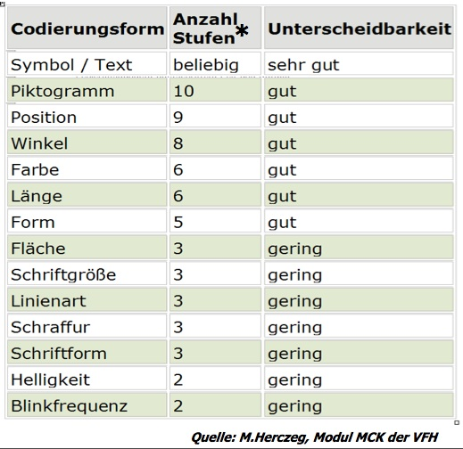

### Die wichtigsten (Text, Farbe, Anordnung, Grafik)

#### Text

mächtigste Codierungsform mit der Fähigkeit nahezu **jede Information** zu repräsentieren.

-	beliebige Informationsfülle
-	Erfassen erfordert **kognitive Arbeit**
-	**Struktur** unterstützt die gezielte Erfassung

#### Farbe

sehr wirksame Codierungsform, vor allem zur **Hervorhebung** bestimmter Informations**kategorien**

##### Einsatzmöglichkeiten

-	visualisieren von **Systemzuständen**
-	**Hervorheben** zusammen gehöriger Inhalte
-	**Markieren** von Bildschirmobjekten
-	herstellen von **Informationsbeziehungen**
-	**Trennen** von Informationskategorien
-	**Aufgliedern** gleichartiger Informationen
-	**Gliedern** langer Dialogabläufe

##### Benutzung von Farbe

Der Systementwurf sollte zunächst **voll funktionsfähig einfarbig** sein, da ca. 8% der Bevölkerung farbenblind ist.

-	**sparsam** verwenden
-	feste Bedeutung, **konsistent** einsetzen
-	maximal **6 bedeutungstragende** Farben
-	**nicht** zur Unterscheidung **kleiner Bildschirmobjekte**
-	Farbbedeutungen (Bsp.):
	-	Rot: Alarm
	-	Gelb: Vorsicht
	-	Grün: In Ordnung

##### Probleme

-	Kontrast
-	Schärfe
-	Standardbedeutungen
-	Manipulationsmöglichkeiten durch Standardbedeutungen

#### Anordnung

Codierungsform auf der Basis der Gestaltgesetze zur Gruppierung und Isolation von Informationselementen. **Chunking** zur KZG-Entlastung.

##### Probleme

-	Manipulationsmöglichkeiten durch Fehlanordnung

#### Grafik

Codierungsform, vor allem zur **Visualisierung** komplexer oder umfangreicher Informationsmengen. Hohe Datenreduktion, gute Decodierbarkeit

##### Probleme

-	Manipulationsmöglichkeiten durch Skalierung (z.B. irreführende Diagrammachsen)
